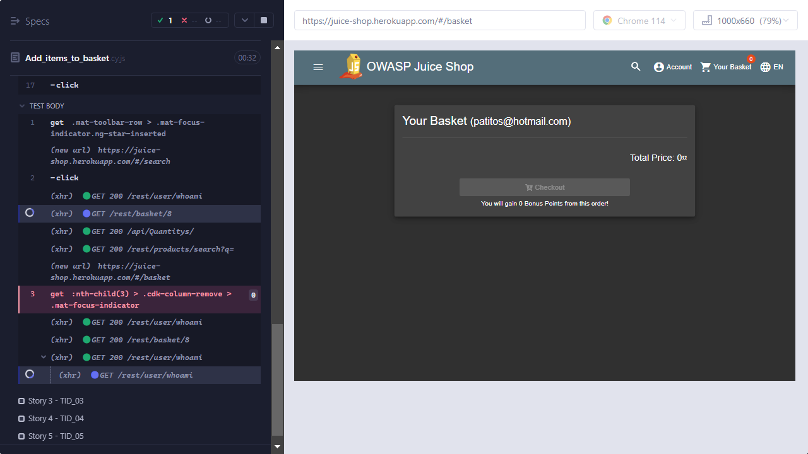
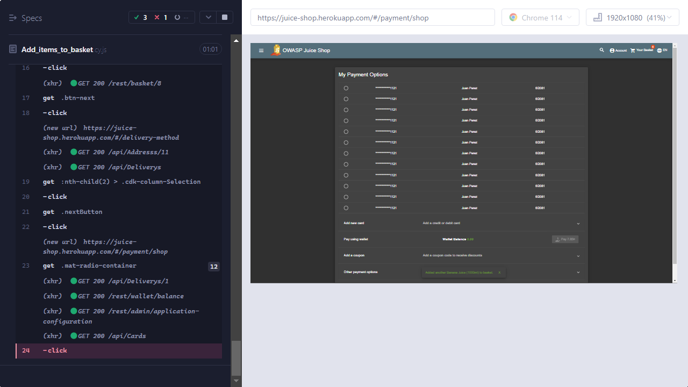

# Introduction

Before starting a new automation project is important to verify the version of Node.js and npm, we need to ensure that we have the appropiate versions of these tools installed on our system to work on our project.

Node.js is the JavaScript runtime environment that allows you to execute JavaScript code outside the browser, on the server-side. npm is the package manager for Node.js

    Verifying the version of Node.js and npm is important for several reasons:

1. Version compatibility: Some projects may require specific versions of Node.js and npm. Checking the versions will allow you to ensure that you are using the correct versions for that particular project.
2. Functionality and features: The latest versions of Node.js and npm may introduce new features and improvements. Checking the versions will allow you to take advantage of these enhancements and utilize the latest available functionalities.
3. Troubleshooting and compatibility: Sometimes, certain versions of Node.js or npm may have known issues or incompatibilities with other libraries or dependencies. Checking the versions helps you identify potential problems and ensure compatibility with other tools you will be using in your project.

To check the version of Node.js and npm, we can execute the following commands in our terminal or command line.

 `node --version`

 `npm --version`

By performing these checks, you will be able to confirm that the versions of Node.js and npm are suitable for your project and ensure you have a compatible development environment.

# Methodology

After verifying the versions of Node.js and npm and ensuring we have the proper setup, we can start performing the following tasks to initiate with our Cypress automation project:

We can initialize our project by running `npm init` to create the `package.json` file that will contain the information and dependencies for our project. Then we install Cypress and its dependencies in our directory by running the command `npm install cypress --save-dev`.

After installation, we can run the command `npx cypress open` to open the Cypress user interface. From there, you can configure your project, create test files, test suites, and explore Cypress functionality.

Once, We have open Cypress interface and selected E2E Testing. We´ll see our test suite listed at the top left corner of the Cypress Test Runner Interface.

Once you have set up your Cypress project and completed the initial setup, you can start organizing your stories and test cases into different folders and routes.Once, done this we can start to configure out our stories and test cases in different folders and routes... So, let's start

## About the exercise

For this exercise, I've chosen juice shop page to automate with cypress. Creating a previous story to make some interested in the exercise...
Joan May, a juice enthusiast, discovered Juice Shop, a website filled with amazing flavors.
With bold searches, he added strawberry-mint juices, explosive tropical blends, and spicy-refreshing drinks to his cart. Upon receiving his order, Joan enjoyed an exceptional flavor
experience and became a loyal follower of Juice Shop, recommending it to all juice lovers.

## Results 

By the end, Cypress provides built-in functionality to generate videos of test scenarios and capture screenshots in case of errors.

